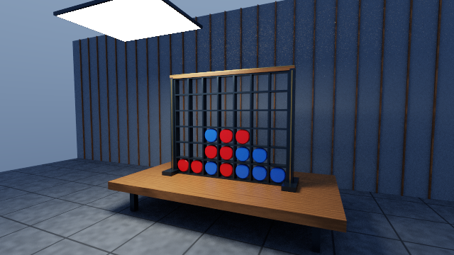

# 4 Gewinnt – PBR Pathtraced Edition

Ein spielbares Vier-Gewinnt mit progressivem OpenGL-Compute-Pathtracing,
Metall-/Kunststoffmaterialien, prozeduralem Holz und Stein sowie geometriegestütztem Denoising.



*Echter Renderer-Screenshot: 640×360, 192 spp, 3 Bounces; Beispielbrett mit 14 Zügen.*

## Start

JDK 25 und Maven installieren. OpenGL 4.3 oder neuer ist erforderlich;
4.6 wird bevorzugt, mit Fallback auf 4.3. Windows-Natives sind voreingestellt.

```sh
mvn test
mvn compile exec:java
# Konsolenbeispiel ohne Grafik
mvn compile exec:java -Dexec.args=--console
# Linux x86_64
mvn compile exec:java -Dlwjgl.natives=natives-linux
```

WASD bewegt die Kamera, die eingefangene Maus dreht sie ohne zusätzliche Maustaste.
Tasten 1–7 werfen abwechselnd rote/blaue Steine ein. Siege und Unentschieden
beenden die Eingabe. Escape öffnet/schließt das Pausenmenü mit Weiter, Neustart
und Beenden. `Window.create(Board)` übernimmt das übergebene Brett einschließlich
Zugfolge und eines bereits bestehenden Gewinners; `create()` startet leer.

Unter Windows bei Bedarf `java.exe`/`javaw.exe` unter Einstellungen → System →
Anzeige → Grafik auf **Hohe Leistung** setzen. Der verwendete OpenGL-Renderer
wird beim Start ausgegeben. Das interaktive Fenster lehnt Software-Renderer ab;
der separate EGL-Test erlaubt Software-Rendering zur automatisierten Prüfung.

## Bildqualität und Umgebung

- GGX-Mikrofacetten-BRDF mit Schlick-Fresnel, Smith-Masking und
  Metallic/Roughness-Materialien. Diffuse und spiegelnde Pfade verwenden
  eine gemeinsame, zur Stichprobenwahl passende Wahrscheinlichkeitsdichte.
- Ein rechteckiges Flächenlicht mit Schattenstrahlen und weichen Schatten.
  Multiple Importance Sampling gewichtet Licht- und BRDF-Sampling, damit
  indirekte Lichttreffer die Energie nicht doppelt addieren. Der letzte Bounce
  verwendet ausschließlich den Direktlichtschätzer ohne konkurrierendes Gewicht.
- Walnussholz mit Maserung und variabler Rauheit, Steinfliesen, dunkler
  Metallrahmen, Messingdetails und farbige Spielsteine mit abgeschrägtem Rand.
  Texturen werden im Weltkoordinatenraum berechnet: keine Downloads, keine UV-Nähte.
- Tisch, Standfüße, Boden, Lamellenwand und seitliche Startperspektive.
- Der 5×5-Bilateralfilter verwendet Normale, Tiefe, Albedo und Material-ID.
  Die Filterstärke sinkt bei steigender Samplezahl, um Details zu erhalten.
  Filmic-Tonemapping und eine einzige lineare → sRGB-Konvertierung folgen danach.
- Kamera-, Szenen- und Auflösungsänderungen setzen die Accumulation zurück.
  Der Samplezähler zeigt tatsächliche Samples pro Pixel, nicht Frames.
- Pausenmenü und Klickbereiche verwenden das aktuelle Seitenverhältnis;
  Cursorpositionen werden in Fensterkoordinaten statt Framebuffer-Pixeln ausgewertet.

## Einstellungen

Standard: maximal **960×540**, **3 Bounces**, **4 Samples pro Frame**, **8×8**
Workgroup und **RGBA32F**. Mehr Bounces und Schattenstrahlen kosten GPU-Zeit;
Frameraten müssen auf der Zielhardware gemessen werden.

```sh
# Schnellerer Modus für schwächere GPUs; weniger indirektes Licht
mvn compile exec:java -Dpt.bounces=1 -Dpt.samplesPerFrame=2
# Höhere Qualität
mvn compile exec:java -Dpt.width=1920 -Dpt.height=1080 -Dpt.samplesPerFrame=8 -Dpt.bounces=4
# Ohne Denoiser als Vergleich
mvn compile exec:java -Dpt.noDenoise=true
# Diagnose ohne Pathtracing-Farbwerte
mvn compile exec:java -Dpt.gradient=true
# Langsamer Referenzpfad ohne BVH
mvn compile exec:java -Dpt.bruteForce=true
# VSync aus; FPS/spp zusätzlich auf stdout
mvn compile exec:java -Dpt.benchmark=true -Dpt.groupX=16 -Dpt.groupY=8
# Experimentelle Halbpräzision nur für den Akkumulationspuffer
mvn compile exec:java -Dpt.half=true
# Nach acht Frames beenden und auf GL-Fehler prüfen
mvn compile exec:java -Dpt.smokeFrames=8
```

Gültig sind 1–8 Bounces, 1–16 Samples/Frame und Workgroups 8×8, 16×8 oder 16×16.
RGBA16F kann bei vielen Samples durch Quantisierung stagnieren; RGBA32F bleibt Standard.
Der Denoiser ist räumlich, ohne Motion Vectors oder zeitliche Reprojektion. Beim
Bewegen der Kamera beginnt die progressive Mittelung erneut. Glas/Transmission,
Bildtexturimport, OBJ/glTF-Import und mehrere gesampelte Flächenlichter sind nicht enthalten.

## Datenfluss

Scene/Camera/Mesh → CPU-BVH (binäre 12-Bin-SAH) → SSBO-Upload → Compute-Pathtracing
mit Primary-Hit-Guides → progressiver HDR-Mittelwert → Denoising → Tonemapping → sRGB.

SSBO-Vertrag (`std430`, native Byte-Reihenfolge):

| Binding | Inhalt | Stride |
|---|---|---|
| 0 | Vertex: `vec4(position, 0)` | 16 Bytes |
| 1 | Triangle: `uvec4(a,b,c,material)` | 16 Bytes |
| 2 | Material: `vec4(baseColor,0)`, `vec4(emission,0)`, `vec4(roughness,metallic,texture,scale)` | 48 Bytes |
| 3 | Node: `vec4(min,0)`, `vec4(max,0)`, `ivec4(left,right,first,count)` | 48 Bytes |

Image-Bindings: 0 HDR-Accumulierung (RGBA32F oder RGBA16F), 1 Normale/Tiefe
(RGBA32F), 2 Albedo/Material-ID (RGBA16F). Tiefe 0 und Material-ID −1 kennzeichnen
Himmel. Die Guides entstehen aus einem unverwackelten Primärstrahl pro Pixel.
Shader und Java-Upload müssen bei Änderungen des Materiallayouts gemeinsam aktualisiert werden.

BVH-Blätter zeigen auf die sortierten Dreiecke. Die maximale Baumtiefe 30 passt
in den 32er Shader-Stack. Compute und Ausgabe werden über Image-/Texture-Barrieren
synchronisiert. Nach Reset wird kein undefinierter Akkumulationsinhalt gelesen.

## Tests

`mvn test` führt die eigenständigen CPU-Regressionen aus:

- `BVHTest`: Blattabdeckung, Bounds, Tiefe, degenerierte Geometrie, leere Szene
  und 6000 deterministische BVH-/Brute-Force-Strahlvergleiche.
- `SceneRegressionTest`: übergebenes Brett, Zugfolge, ungültige Züge, Sieg/Neustart,
  geschlossene und korrekt orientierte Bevel-Geometrie, Indizes sowie identische
  Fläche von Lichtgeometrie und Lichtsampler.

Der Linux/EGL-Test prüft tatsächliche Shaderkompilierung und LWJGL-Uploads,
Accumulation, Reset, Resize, Szenenwechsel, Pausen-Rendering, endliche/nichtleere
Ausgabe, pixelweisen BVH-/Brute-Force-Vergleich sowie alle sechs
Format-/Workgroup-Kombinationen:

```sh
EGL_PLATFORM=surfaceless mvn test-compile exec:java -Dlwjgl.natives=natives-linux -Dexec.mainClass=de.viergewinnt.renderer.RendererSmokeTest -Dexec.classpathScope=test
```

Diese Überarbeitung wurde mit ECJ unter Java 17 gegen LWJGL 3.4.3 kompiliert und
auf Mesa/llvmpipe über EGL geprüft; außerdem wurde ein 640×360-Rendering mit
192 Samples pro Pixel visuell kontrolliert. Der konfigurierte Maven-/JDK-25-Build,
interaktive Eingabe, Windows-/HiDPI-Verhalten und Leistung auf echten GPUs müssen
zusätzlich auf der Zielplattform geprüft werden.
