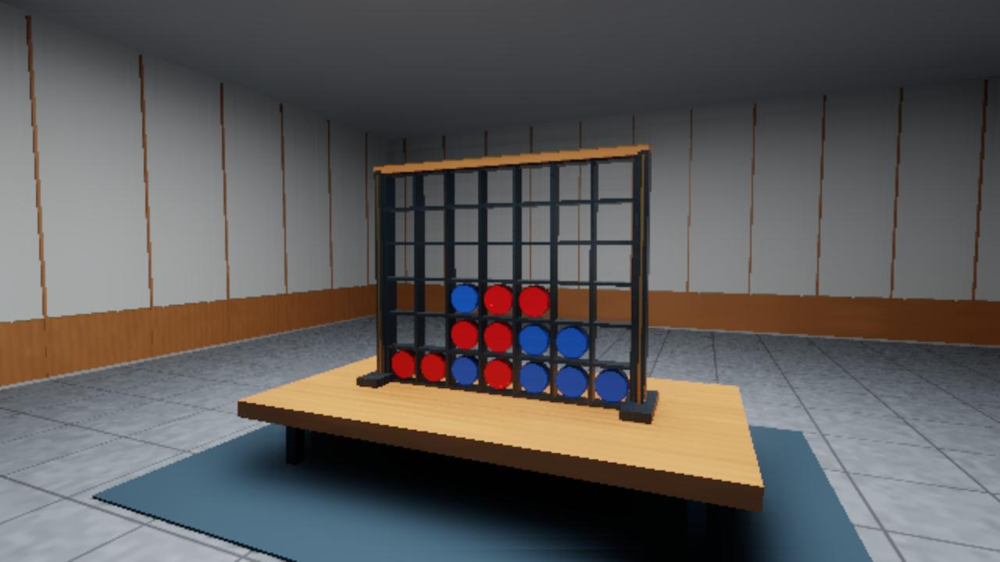
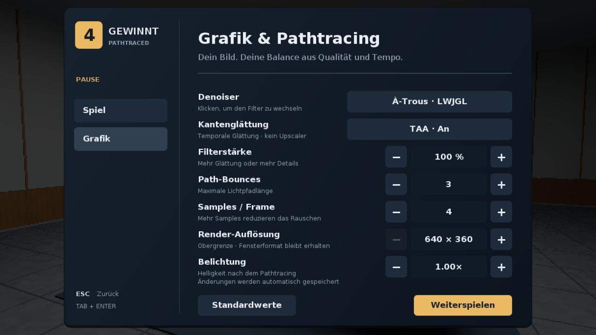
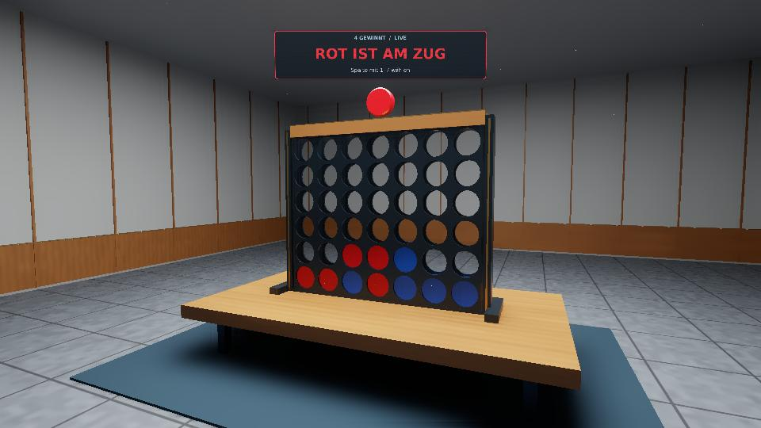
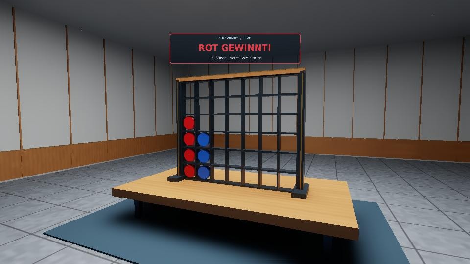
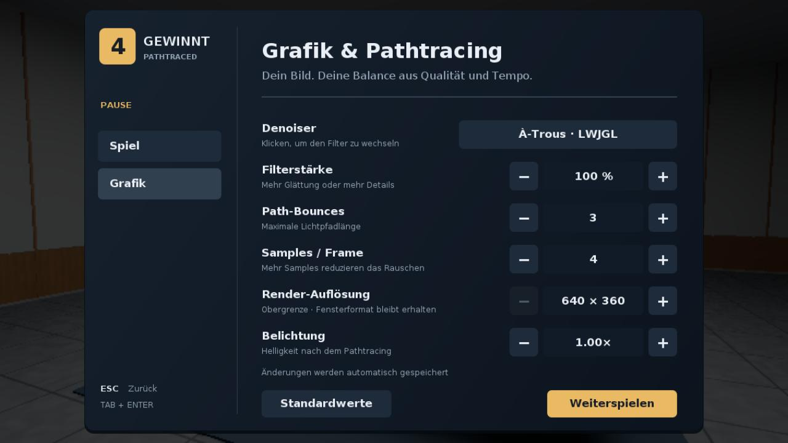

# 4 Gewinnt – PBR Pathtraced Edition

Ein spielbares Vier-Gewinnt mit progressivem OpenGL-Compute-Pathtracing,
Metall-/Kunststoffmaterialien, prozeduralem Holz und Stein sowie geometriegestütztem Denoising.



*Echter Renderer-Screenshot: intern 640×360, Ausgabe 1280×720, 100 spp, 3 Bounces und À-Trous; Beispielbrett mit 14 Zügen.*

## Start

JDK 25 und Maven installieren. OpenGL 4.3 oder neuer ist erforderlich;
4.6 wird bevorzugt, mit Fallback auf 4.3. Windows-Natives sind voreingestellt.

```sh
mvn test
mvn compile exec:java
# Konsolenbeispiel ohne Grafik
mvn compile exec:java -Dexec.args=--console
# Linux x86_64
mvn compile exec:java -Dlwjgl.natives=natives-linux
```

WASD bewegt die Kamera, die eingefangene Maus dreht sie ohne zusätzliche Maustaste.
Tasten 1–7 werfen abwechselnd rote/blaue Steine ein. Siege und Unentschieden
beenden die Eingabe. Escape öffnet/schließt das Pausenmenü mit Weiter, Neustart
und Beenden. `Window.create(Board)` übernimmt das übergebene Brett einschließlich
Zugfolge und eines bereits bestehenden Gewinners; `create()` startet leer.

Unter Windows bei Bedarf `java.exe`/`javaw.exe` unter Einstellungen → System →
Anzeige → Grafik auf **Hohe Leistung** setzen. Der verwendete OpenGL-Renderer
wird beim Start ausgegeben. Das interaktive Fenster lehnt Software-Renderer ab;
der separate EGL-Test erlaubt Software-Rendering zur automatisierten Prüfung.

## Automatische Shader-Präzision: AMD FP16 / FP32

Standard ist `-Dpt.precision=auto`: AMD-Geräte nutzen einen Mixed-FP16/FP32-Pfad,
sofern der aktive OpenGL-Treiber eine passende Shader-Erweiterung meldet.
Andere Hersteller bleiben automatisch bei FP32. Eine fehlende Erweiterung oder ein
Fehler beim Übersetzen/Linken des optionalen FP16-Shaders führt zurück zu FP32.
Der tatsächlich verwendete Pfad und das Akkumulationsformat werden beim Start ausgegeben.

```sh
# Automatisch: AMD + Erweiterung → Mixed FP16, sonst FP32
mvn compile exec:java -Dpt.precision=auto
# FP32 als Vergleich oder Kompatibilitätsmodus
mvn compile exec:java -Dpt.precision=fp32
# FP16 auch auf anderen Herstellern versuchen; sicherer FP32-Fallback
mvn compile exec:java -Dpt.precision=fp16
```

Explizite `f16vec4`-Farbrechnung und auf dem AMD-Erweiterungspfad Half-FMA ermöglichen
Packed-FP16-Operationen in der Materialauswertung. Schnittpunkte, BVH, GGX-Verteilung,
PDFs, Lichtgewichte, TAA und die standardmäßige HDR-Akkumulation bleiben FP32.
Das bisherige `-Dpt.half=true` betrifft ausschließlich den experimentellen
Akkumulationsspeicher und ist davon unabhängig.

**Packed FP16 ist keine Garantie für Dual-Issue oder doppelte Spiel-FPS.**
Die tatsächlich erzeugten Instruktionen und Laufzeiten hängen von GPU und Compiler ab.
Der native AMD-Pfad ist in der verfügbaren Testumgebung noch nicht hardwarevalidiert.
[Details, Quellen und Tests](docs/shader-precision.md).

## TAA-Kantenglättung

Unter **ESC → Grafik → Kantenglättung** lässt sich TAA sofort ein- und ausschalten.
TAA ist standardmäßig aktiv und wird mit den anderen Einstellungen gespeichert.
`-Dpt.taa=false` deaktiviert es beim Start. Ältere Einstellungsdateien bleiben gültig.

Die temporale Glättung kombiniert wechselnde Subpixel-Samples mit zurückprojizierten
Bilddaten. Tiefe, Normalen und Material prüfen, ob alte Daten zur aktuellen Oberfläche
passen; ein Abgleich mit der aktuellen Pixel-Nachbarschaft begrenzt Nachziehspuren.
Bei fallenden Steinen, Szenenwechseln und Auflösungsänderungen wird der Verlauf
verworfen. Der Zufallssample-Zähler läuft bei Kamerabewegungen weiter.

TAA arbeitet in der eingestellten Render-Auflösung und fügt keinen Upscaler hinzu.
Die progressive Pathtracing-Akkumulation bleibt erhalten. Menü und Hologramm werden
anschließend gezeichnet und dadurch nicht temporal verwischt. Bei bewegten Coins
wird zugunsten sauberer Konturen konservativ auf den bisherigen Verlauf verzichtet.



[Implementierung und GPU-Validierung](docs/taa-validation.md)

## Fallende Spielsteine und echte Öffnungen

Die Tasten 1–7 lassen einen Stein von oben in den gewählten Schacht fallen.
Beschleunigung und ein kurzer, gedämpfter Aufsetzer machen die Bewegung sichtbar.
Die beiden Brettseiten besitzen jeweils 42 kreisförmige Durchbrüche; zwischen ihnen
bleiben sieben durchgehende Fallschächte und oben offene Einwurfschlitze frei.
Die Steine liegen auf dem Boden bzw. direkt aufeinander, statt im Raster zu schweben.

Während des Falls ist der nächste Einwurf gesperrt. Zugwechsel, Sieg und Unentschieden
werden erst nach dem Aufsetzen übernommen. Pause friert den Fall ein; Neustart
entfernt auch den gerade fallenden Stein. Das Hologramm sitzt oberhalb des Einwurfs.

Die GPU verschiebt nur den bewegten Stein per Uniform. Einmalig erweiterte BVH-Grenzen
decken seinen gesamten Fallweg ab; es gibt keinen Szenen-Neuaufbau oder Mesh-Upload
pro Animationsbild. Bei Positionsänderungen werden Akkumulation und Denoiser-Guides
zurückgesetzt, damit keine alten Steinpositionen nachziehen. Kein Upscaler hinzugefügt.



[Gerenderte Fallanimation](docs/coin-drop.mp4) · [Validierung](docs/coin-drop-validation.md)

## Holografischer Spielstatus

Über dem Brett schwebt jetzt eine transparente, räumlich verankerte Statusanzeige:
**Rot/Blau ist am Zug**, **Rot/Blau gewinnt!** oder **Unentschieden**. Farbe und Text
wechseln unmittelbar mit dem Spielzustand. Die Anzeige richtet sich zur Kamera,
bleibt von beiden Seiten lesbar und wird durch die Szenentiefe verdeckt. Dezente
Scanlinien und Leuchtränder laufen in einem separaten Zeichenpass, ohne das
Pathtracing bei jedem Animationsframe zurückzusetzen. Text wird nur bei einer
Statusänderung neu erzeugt und hochgeladen. Spielausgänge werden im Grafikspiel
nicht mehr nur in die Konsole geschrieben; Hardware-/Diagnoselogs bleiben separat.



Der Renderer vermeidet wiederholte Guide-Berechnungen, bricht Schattenstrahlen
am ersten Blocker ab und verwendet gefilterte Bilder bei Belichtungsänderungen
weiter. Auflösung, Samplezahl und Bounce-Limit wurden für diese Optimierungen
nicht reduziert; ein Upscaler wurde nicht hinzugefügt. Im lokalen festen
320×180-Vergleich sank die Framezeit um 16,9 %, bei **byteidentischen HDR-Daten**.
Messaufbau, Grenzen und Testbefehl stehen im
[Validierungsbericht](docs/hologram-performance.md).

## Pausenmenü und Einstellungen

Escape öffnet das neue Pausenmenü. Unter **Grafik** lassen sich Einstellungen
sofort ändern. Maus oder Tab/Pfeiltasten + Enter bedienen dieselben Controls;
Escape geht aus Grafik zurück zur Spielseite und setzt von dort das Spiel fort.



| Einstellung | Auswahl |
|---|---|
| Denoiser | **À-Trous · LWJGL** (Standard), **Eigener · Bilateral**, **Aus** |
| Filterstärke | 25–200 %; bei ausgeschaltetem Denoiser deaktiviert |
| Path-Bounces | 1–8 |
| Samples / Frame | 1, 2, 4, 8, 16 |
| Render-Auflösung | Obergrenze 640×360, 960×540, 1280×720, 1920×1080, 3840×2160 |
| Belichtung | 0,25×–3× |

**Standardwerte** stellt die Werkseinstellungen wieder her. Einstellungen werden
atomar unter `~/.viergewinnt/render.properties` gespeichert (auch unter Windows
im Benutzerverzeichnis). `-Dpt.settingsFile=...` wählt eine andere Datei.
Explizite `-Dpt.*`-Startparameter haben beim Start Vorrang. Kann nicht gespeichert
werden, zeigt das Menü „Nur für diese Sitzung“ an; die Steuerung bleibt nutzbar.
Beschädigte Konfigurationsdateien führen zu Standardwerten statt zu einem Absturz.

Denoiser, Filterstärke und Belichtung behalten die vorhandenen Rohsamples bei.
Bounces, Samples/Frame und Auflösung setzen die Accumulation zurück. Während der
Pause berechnet der Renderer maximal bis 64 spp weiter und friert das Bild danach
ein; UI-Änderungen benötigen dann kein erneutes Pathtracing.

Der zweite Filter ist eine angepasste, quelloffen mitgelieferte Implementierung
von [LWJGLs À-Trous-Denoiser](https://github.com/LWJGL/lwjgl3-demos/blob/0846b5d965e3015c556ac26b802b63f8ea8aa129/res/org/lwjgl/demo/opengl/raytracing/tutorial5/atrous.fs.glsl).
Er läuft in vier GPU-Durchläufen mit Schrittweiten 1, 2, 4, 8 und verwendet
Farbe, Normale, Flächenabstand, Albedo und Material-ID als Kantenschutz.
Originalshader, BSD-3-Clause-Lizenz und Änderungsnotiz liegen unter
`src/main/resources/third-party/lwjgl-atrous/` und werden mit der Anwendung verpackt.
Es handelt sich um einen räumlichen Wavelet-Filter, nicht um einen KI-Denoiser.

## Bildqualität und Umgebung

- GGX-Mikrofacetten-BRDF mit Schlick-Fresnel, Smith-Masking und
  Metallic/Roughness-Materialien. Diffuse und spiegelnde Pfade verwenden
  eine gemeinsame, zur Stichprobenwahl passende Wahrscheinlichkeitsdichte.
- Ein rechteckiges Flächenlicht mit Schattenstrahlen und weichen Schatten.
  Multiple Importance Sampling gewichtet Licht- und BRDF-Sampling, damit
  indirekte Lichttreffer die Energie nicht doppelt addieren. Der letzte Bounce
  verwendet ausschließlich den Direktlichtschätzer ohne konkurrierendes Gewicht.
- Walnussholz mit Maserung und variabler Rauheit, Steinfliesen, dunkler
  Metallrahmen, Messingdetails und farbige Spielsteine mit abgeschrägtem Rand.
  Texturen werden im Weltkoordinatenraum berechnet: keine Downloads, keine UV-Nähte.
- Ein geschlossener Raum mit **44×52 Welteinheiten** Grundfläche, Decke,
  Wandverkleidung, umlaufenden Details und zentraler Deckenbeleuchtung.
  Tisch und Spielfeld stehen bei **X=0, Z=0** auf einem zentralen Teppich.
  Die Kamera kann um den Tisch herumgehen; Tisch und Außenwände begrenzen die Bewegung.
- Der bisherige 5×5-Bilateralfilter bleibt als **Eigener** auswählbar; seine
  Filterstärke sinkt bei steigender Samplezahl. Alternativ steht der mehrstufige
  **À-Trous**-Filter zur Verfügung. Filmic-Tonemapping und eine einzige
  lineare → sRGB-Konvertierung folgen danach.
- Kamera-, Szenen- und Auflösungsänderungen setzen die Accumulation zurück.
  Der Samplezähler zeigt tatsächliche Samples pro Pixel, nicht Frames.
- Pausenmenü und Klickbereiche verwenden das aktuelle Seitenverhältnis;
  Cursorpositionen werden in Fensterkoordinaten statt Framebuffer-Pixeln ausgewertet.

## Einstellungen

Standard: maximal **960×540**, **3 Bounces**, **4 Samples pro Frame**, **8×8**
Workgroup, **RGBA32F** und **À-Trous**. Mehr Bounces und Schattenstrahlen kosten GPU-Zeit;
Frameraten müssen auf der Zielhardware gemessen werden.

```sh
# Schnellerer Modus für schwächere GPUs; weniger indirektes Licht
mvn compile exec:java -Dpt.bounces=1 -Dpt.samplesPerFrame=2
# Höhere Qualität
mvn compile exec:java -Dpt.width=1920 -Dpt.height=1080 -Dpt.samplesPerFrame=8 -Dpt.bounces=4
# Denoiser direkt auswählen (zusätzlich im Pausenmenü umschaltbar)
mvn compile exec:java -Dpt.denoiser=atrous
mvn compile exec:java -Dpt.denoiser=own
mvn compile exec:java -Dpt.denoiser=off
# Legacy-Schalter bleibt erhalten
mvn compile exec:java -Dpt.noDenoise=true
# Filterstärke und Belichtung
mvn compile exec:java -Dpt.denoiseStrength=1.25 -Dpt.exposure=1.25
# Diagnose ohne Pathtracing-Farbwerte
mvn compile exec:java -Dpt.gradient=true
# Langsamer Referenzpfad ohne BVH
mvn compile exec:java -Dpt.bruteForce=true
# VSync aus; FPS/spp zusätzlich auf stdout
mvn compile exec:java -Dpt.benchmark=true -Dpt.groupX=16 -Dpt.groupY=8
# Experimentelle Halbpräzision nur für den Akkumulationspuffer
mvn compile exec:java -Dpt.half=true
# Nach acht Frames beenden und auf GL-Fehler prüfen
mvn compile exec:java -Dpt.smokeFrames=8
```

Gültig sind 1–8 Bounces, 1–16 Samples/Frame und Workgroups 8×8, 16×8 oder 16×16.
RGBA16F kann bei vielen Samples durch Quantisierung stagnieren; RGBA32F bleibt Standard.
Beide Denoiser sind räumlich, ohne Motion Vectors oder zeitliche Reprojektion. Beim
Bewegen der Kamera beginnt die progressive Mittelung erneut. Glas/Transmission,
Bildtexturimport, OBJ/glTF-Import und mehrere gesampelte Flächenlichter sind nicht enthalten.

## Datenfluss

Scene/Camera/Mesh → CPU-BVH (binäre 12-Bin-SAH) → SSBO-Upload → Compute-Pathtracing
mit Primary-Hit-Guides → progressiver HDR-Mittelwert → Denoising → Tonemapping → sRGB.

SSBO-Vertrag (`std430`, native Byte-Reihenfolge):

| Binding | Inhalt | Stride |
|---|---|---|
| 0 | Vertex: `vec4(position, 0)` | 16 Bytes |
| 1 | Triangle: `uvec4(a,b,c,material)` | 16 Bytes |
| 2 | Material: `vec4(baseColor,0)`, `vec4(emission,0)`, `vec4(roughness,metallic,texture,scale)` | 48 Bytes |
| 3 | Node: `vec4(min,0)`, `vec4(max,0)`, `ivec4(left,right,first,count)` | 48 Bytes |

Image-Bindings: 0 HDR-Accumulierung (RGBA32F oder RGBA16F), 1 Normale/Tiefe
(RGBA32F), 2 Albedo/Material-ID (RGBA16F). Tiefe 0 und Material-ID −1 kennzeichnen
Himmel. Die Guides entstehen aus einem unverwackelten Primärstrahl pro Pixel.
Shader und Java-Upload müssen bei Änderungen des Materiallayouts gemeinsam aktualisiert werden.

BVH-Blätter zeigen auf die sortierten Dreiecke. Die maximale Baumtiefe 30 passt
in den 32er Shader-Stack. Compute und Ausgabe werden über Image-/Texture-Barrieren
synchronisiert. Nach Reset wird kein undefinierter Akkumulationsinhalt gelesen.

## Tests

`mvn test` führt die eigenständigen CPU-Regressionen aus:

- `BVHTest`: Blattabdeckung, Bounds, Tiefe, degenerierte Geometrie, leere Szene
  und 6000 deterministische BVH-/Brute-Force-Strahlvergleiche.
- `HUDTest`: Spielstatus für beide Farben, Gewinner, Unentschieden und Neustart.
- `MenuSettingsTest`: Menüaktionen, Denoiser-Auswahl, Reglergrenzen, Tastaturfokus,
  HiDPI-/Fensterformat-Transformation, Settings-Roundtrip, beschädigte Einstellungen
  und begehbare Raumgrenzen.
- `SceneRegressionTest`: übergebenes Brett, Zugfolge, ungültige Züge, Sieg/Neustart,
  geschlossene und korrekt orientierte Bevel-Geometrie, Indizes sowie identische
  Fläche von Lichtgeometrie und Lichtsampler.

Der Linux/EGL-Test prüft tatsächliche Shaderkompilierung und LWJGL-Uploads,
Accumulation, Reset, Resize, Szenenwechsel, Pausen-Rendering, endliche/nichtleere
Ausgabe, pixelweisen BVH-/Brute-Force-Vergleich sowie alle sechs
Format-/Workgroup-Kombinationen. Außerdem werden Denoiserwechsel ohne Sampleverlust,
Live-Belichtung, Sampling-Reset, Auflösungswechsel und Einfrieren der Pause geprüft.
`AtrousDenoiserTest` prüft auf der GPU ein deterministisch verrauschtes Bild und
fordert mindestens 50 % weniger mittleren quadratischen Fehler bei erhaltener
Materialkante (65×33 prüft auch unvollständige Workgroups):

```sh
EGL_PLATFORM=surfaceless mvn test-compile exec:java -Dlwjgl.natives=natives-linux -Dexec.mainClass=de.viergewinnt.renderer.RendererSmokeTest -Dexec.classpathScope=test
```

Diese Überarbeitung wurde mit ECJ unter Java 17 gegen LWJGL 3.4.3 kompiliert und
auf Mesa/llvmpipe über EGL geprüft. Die À-Trous-Integration reduzierte im genannten
synthetischen Test den Rausch-MSE um 99,6 %; das ist kein Qualitätsversprechen für
beliebige Spielszenen. Raum, Pausenmenü und Grafikseite wurden als tatsächliche
OpenGL-Ausgaben visuell kontrolliert (1280×720, intern 640×360, 100 spp). Der konfigurierte Maven-/JDK-25-Build,
interaktive Eingabe, Windows-/HiDPI-Verhalten und Leistung auf echten GPUs müssen
zusätzlich auf der Zielplattform geprüft werden.
